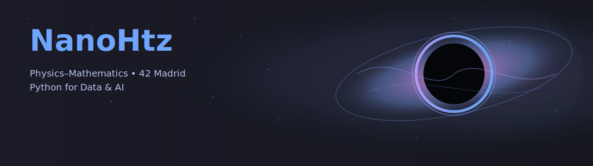

  

<table>
  <tr>
    <td align="center" width="90">
       
      <b>C</b>
    </td>
    <td align="center" width="90">
       
      <b>C++</b>
    </td>
    <td align="center" width="90">
       
      <b>Python</b>
    </td>
    <td align="center" width="90">
       
      <b>Jupyter</b>
    </td>
    <td align="center" width="90">
       
      <b>Linux</b>
    </td>
    <td align="center" width="90">
       
      <b>Git</b>
    </td>
    <td align="center" width="90">
       
      <b>NumPy</b>
    </td>
    <td align="center" width="90">
       
      <b>SciPy</b>
    </td>
    <td align="center" width="90">
       
      <b>SymPy</b>
    </td>
    <td align="center" width="90">
       
      <b>LaTeX</b>
    </td>
    <td align="center" width="90">
       
      <b>Overleaf</b>
    </td>
    <td align="center" width="90">
       
      <b>Makefile</b>
    </td>
    <td align="center" width="90">
       
      <b>Vim</b>
    </td>
  </tr>
</table>

  
  &nbsp;
  
  &nbsp;
  

👋 Hi, I'm Fernando, a Physics–Mathematics dual-degree student at **UNED** and a cadet at **42 Madrid**

- 🎓 Physics–Mathematics dual-degree student at **UNED** (ongoing).
- 🔬 I’m currently refining **minishell** and optimizing **philosophers**.
- 📊🐍 Python for data: completing **Data Analysis with Python** using **NumPy/SciPy/Matplotlib/SymPy** at **Helsinky University**.

<h2 align="center">
  
  &nbsp;Repositories&nbsp;
  
</h2>

<!-- fila superior (2x2) -->

  <!-- Arriba izquierda: Data Analysis -->
  
  <!-- Arriba derecha: fdf -->
  

<!-- fila inferior -->

  <!-- Abajo izquierda: push_swap -->
  
  <!-- Abajo derecha: minishell -->
  

<!-- =========  SHOW MORE  ========= -->

  
<big><b>Show more</b></big>

  <!-- Fila 1 -->
  

    
    
  

  <!-- Fila 2 -->
  

    
    
  

  <!-- Fila 3 -->
  

    
    
  

  <!-- ======= PLANTILLA (comentada) =======
  

    
    
  

  ======================================= -->

  <!-- Plantilla para añadir más (mantén 2 por fila) -->
  <!--
  

    
    
  

  -->

  

<!-- ===== Stats & Languages (header) ===== -->
<h2 align="center">
  📊&nbsp;Stats&nbsp;&amp;&nbsp;Languages
</h2>

  
  

